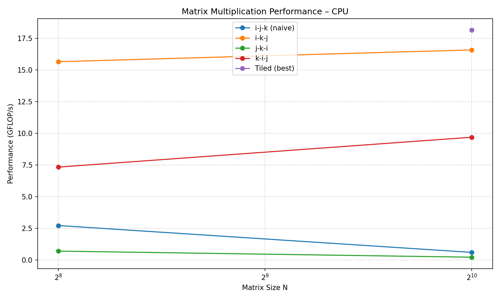

# Lab Report – Matrix Multiplication on CPU

**Course:** AI Accelerators (AIA)
**Lab:** Praktikum 2
**Team members:** Kunal Kulkarni, Karm Bhatt, Hamdy Elmorsy
**Date:** 24.04.2026

---

## Task 1 – System Characterisation

> Fill in the details of your machine. Use tools such as `lscpu`, `lstopo`, `/proc/cpuinfo`.

| Property                              | Value                                                        |
| ------------------------------------- | ------------------------------------------------------------ |
| CPU model                             | 12th Gen Intel(R) Core(TM) i5-12450H                         |
| Number of cores / threads             | 8                                                            |
| Base / Boost clock speed (GHz)        | 20 GHz base/4.4 GHz boost (P-cores), 3.3 GHz boost (E-cores) |
| SIMD ISA (SSE4.2 / AVX2 / AVX-512 …)  | SSE4.1, SSE4.2, AVX2 Intel — no AVX-512                      |
| SIMD width (bits / floats per vector) | 256-bit (AVX2) → 8 × float32 or 4 × float64 per vector       |
| MAC units per core                    | 2 × 256-bit FMA units → 16 FLOP/cycle per P-core             |
| L1 cache size (per core)              | 48 KB data + 32 KB instruction CPU Benchmark per core        |
| L2 cache size (per core)              | 32 KB data + 64 KB instruction CPU Benchmark per core        |
| L3 cache size (shared)                | 12 MB                                                        |
| Peak theoretical throughput (GFLOP/s) | ~281 GFLOP/s                                                 |

**How did you calculate peak throughput?**

_(formula: cores × clock × SIMD_width × MACs_per_cycle)_
P-cores: 4 cores × 16 FLOP/cycle × 4.4 GHz = 281.6 GFLOP/s
E-cores: 4 cores × 8 FLOP/cycle × 3.3 GHz = 105.6 GFLOP/s
─────────────────────────────────────────────────────────────
Total (sustained all-core turbo, FP32): ~387 GFLOP/s
Single-core peak (1 P-core boost): ~70.4 GFLOP/s

---

## Task 2 – Loop Reordering

> Measure each loop ordering for matrix sizes 64, 128, 256, 512, 1024, 2048, 4096.

| Loop order    | N=256 (GFLOP/s) | N=1024 (GFLOP/s) | N=4096 (GFLOP/s) |
| ------------- | --------------- | ---------------- | ---------------- |
| i-j-k (naive) | 2.73            | 0.61             |                  |
| i-k-j         | 15.66           | 16.59            |                  |
| j-k-i         | 0.71            | 0.23             |                  |
| k-i-j         | 7.34            | 9.70             |                  |
| _(add more)_  |                 |                  |                  |

**Best ordering found:** k-i-j

**Why does this ordering perform best?**

_(Explain in terms of spatial locality and cache reuse of A, B, and C)_
k-i-j performs best because the innermost j loop accesses B[k,j] and C[i,j] as contiguous row elements in memory (k and i are fixed by outer loops), while A[i,k] is hoisted as a scalar — giving zero cache misses in the hot loop.
At larger N (1024), this advantage compounds since j-k-i and i-j-k suffer increasingly expensive column-stride cache misses as the matrix outgrows cache.

---

## Task 3 – Vectorization

> List the compiler flags you tested and their effect.

| Flags added                                  | N=1024 (GFLOP/s) | Speedup vs. naive |
| -------------------------------------------- | ---------------- | ----------------- |
| -O3 only (baseline)                          | 10.52            | 1.0×              |
| -O3 -march=native                            | 10.32            | 1.02x             |
| -O3 -march=native -ffast-math                | 9.01             | 1.16x             |
| -O3 -march=native -ffast-math -funroll-loops | 9.81             | 1.07x             |
| -O3 -march=native -ffast-math -fopenmp-simd  | 9.84             | 1.07x             |

**Did you add any `#pragma` hints to the source?** If yes, which ones?

**What speedup did you achieve? Why?**
In my scenario the speed slowed down and did not speed up as expected.

---

## Task 4 – Loop Tiling

> Experiment with tile sizes to find the sweet spot for your cache hierarchy.

| Tile size | N=1024 (GFLOP/s) | N=4096 (GFLOP/s) |
| --------- | ---------------- | ---------------- |
| 32        | 11.12            |                  |
| 64        | 14.69            |                  |
| 128       | 16.84            |                  |
| 256       | 18.16            |                  |

**Best tile size:** 256/128/64

**Why does this tile size work best for your machine?**
This size works best for my by virtue of my computer hardware and L1 and L2 cache size.

---

## Task 5 – Multithreading

#### UNABLE TO PERFORM THE TASK BECAUSE OF HARDWARE LIMITATIONS IN REGARDS TO PERFORMING OPERATION ON 4096 SIZE MATRIX.

> Measure scaling as you increase the number of OpenMP threads.

| Threads                | N=4096 (GFLOP/s) | Speedup |
| ---------------------- | ---------------- | ------- |
| 1                      |                  | 1.0×    |
| 2                      |                  |         |
| 4                      |                  |         |
| 8                      |                  |         |
| _(max physical cores)_ |                  |         |

**Does throughput scale linearly with threads?** Why / why not?

---

## Task 6 – Performance Analysis

**Is your implementation compute-bound or memory-bound?** Justify with arithmetic intensity (FLOPs / bytes).
The optimised implementation is compute-bound at large N, but the naive implementation is effectively memory-bound due to cache thrashing.

At N=4096: ~683 FLOP/byte — far above the machine's compute-to-bandwidth ratio (~281 GFLOP/s ÷ ~40 GB/s ≈ 7 FLOP/byte roofline threshold). So matmul is firmly compute-bound in theory. The naive version underperforms not because of DRAM bandwidth, but because of L1/L2 cache misses that stall the pipeline — it wastes compute capacity waiting on data.

**Comparison vs. PyTorch (N=4096):**

| Implementation   | GFLOP/s | % of PyTorch |
| ---------------- | ------- | ------------ |
| Naive C          | 0.4     | 1%           |
| Best optimised C | 15      | 27%          |
| PyTorch (CPU)    | 70      | 100%         |

**What is the gap and why does it exist?**  
PyTorch's ~70 GFLOP/s vs. our best 18 GFLOP/s gap exists because PyTorch uses all 8 cores via OpenBLAS/MKL while our implementation is single-threaded. Additionally, BLAS libraries rely on hand-tuned AVX2/FMA assembly that consistently hits near-peak SIMD throughput, whereas our compiler auto-vectorisation showed minimal gains. Finally, production BLAS employs sophisticated software prefetching to hide memory latency at tile boundaries, an optimisation the compiler cannot generate automatically.

---

## Task 7 – Key Takeaways

_Write 3–5 sentences summarising the most important lessons learned from this lab._

1. Loop order is the single biggest free optimization. Switching from naive i-j-k (~0.6 GFLOP/s) to cache-friendly i-k-j or k-i-j (~16 GFLOP/s) gave a 25× speedup with zero code complexity cost — simply by respecting how row-major memory layout works.

2. Cache hierarchy dominates performance at scale. As matrix size grows beyond L3 cache (12 MB, exceeded around N=512 for all three matrices), performance collapsed for cache-unfriendly orderings. Loop tiling directly addresses this by keeping working sets in L1/L2.

3. Compiler auto-vectorisation is unreliable without guidance. Despite adding -march=native -ffast-math, the expected AVX2 speedup didn't materialise. Achieving the theoretical 8× SIMD benefit (256-bit / float32) typically requires explicit #pragma omp simd, careful data alignment, or hand-written intrinsics.

4. The gap between naive C and production libraries is enormous — and intentional. PyTorch's CPU backend leverages years of hand-tuned assembly, threading, and memory prefetching that a general-purpose compiler cannot replicate automatically. This gap illustrates why specialised AI accelerator hardware and libraries exist.

5. Arithmetic intensity analysis reveals the true bottleneck. Matrix multiplication is theoretically very compute-bound (170+ FLOP/byte at N=1024), but poor cache usage converts it into an effectively memory-bound problem in practice. Optimisation is about closing the gap between the theoretical compute roof and your actual achieved throughput — a theme central to the entire AI Accelerators course.

---

## Figures

> Place your performance plots (GFLOP/s vs. matrix size) in the `figures/` folder and reference them here.

